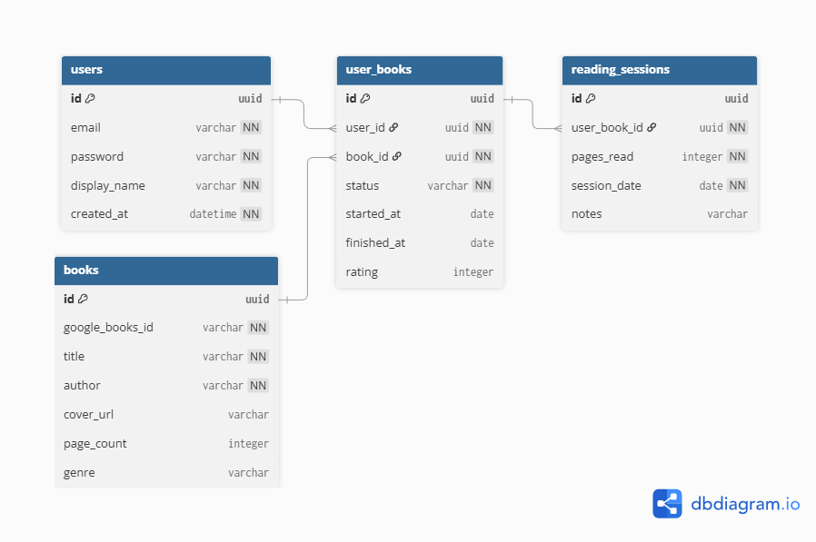

# Raffy

A personal reading tracker that computes insights from your reading habits. 
It tracks your books, logs reading sessions, and derives analytics 
(pace, momentum, streaks, genre patterns, book leaderboard) entirely from 
raw session data.

The frontend, containerization and CI/CD is in active development. 
This repository currently contains the complete backend.

---

## Tech Stack

| Layer          | Technology              | Notes                                                                         |
|----------------|-------------------------|-------------------------------------------------------------------------------|
| Backend        | Spring Boot             | Industry standard for Java REST APIs. Clean structure, strong ecosystem.      |
| Security       | Spring Security + JWT   | Stateless auth. No sessions, no cookies. Every request carries its own token. |
| Database       | MariaDB + JPA/Hibernate | Relational data with lazy loading. ORM keeps the code clean.                  |
| API Docs       | SpringDoc / Swagger UI  | Auto-generated, interactive docs. Available at `/api-ui`.                     |
| Build          | Maven                   | Standard Java build tool.                                                     |
| Frontend (WIP) | React + TailwindCss     | Component-driven UI with a clean design system.                               |

---

## Architecture

The project is organized by feature. Each package owns its entity, repository, service, and controller.

```
com.petros.raffy
├── auth          # JWT generation, filter, registration, login
├── book          # Global book reference + Google Books proxy
├── config        # Security, Swagger, global exception handling
├── insights      # Computed analytics (no entity, no DB writes)
├── session       # Reading session logging and journal
├── user          # User entity + Spring Security integration
└── userbook      # User-specific library entries
```

Key decisions worth knowing:

 - **Single insights endpoint**
   - `GET /insights` returns all analytics in one call. This was a deliberate choice: all five computations share the same two database queries (sessions + user books). Splitting into five endpoints would multiply that to ten queries with no benefit, since all insights appear on the same page.

 - **Book pace vs total momentum**
   - Book pace is computed per book and lives in `UserBookResponse`. Total and monthly momentum are user-level stats and live in `InsightsResponse`. They answer different questions.

 - **Find-or-create for books**
   - When a user adds a book, the backend checks if it already exists by `googleBooksId`. If it does, it's reused. One row per book, shared across all users.

### Database Schema 
<!--suppress CheckImageSize -->


`user_books` is the core of the schema. Rather than linking sessions directly
to books, each `session` belongs to a `user_book`, which is the record of a specific `user`
having a specific `book` (their "personal copy" of it). 

This keeps user context implicit throughout the
session layer and lets the schema carry per-reading state like
status, start date, finish date and rating without polluting either the
`user` or `book` tables.

---
## API

All endpoints except `/auth/*` and `/api-ui` require a Bearer token.

| Method | Endpoint                | Description                           |
|--------|-------------------------|---------------------------------------|
| POST   | `/auth/register`        | Register and receive a JWT            |
| POST   | `/auth/login`           | Login and receive a JWT               |
| GET    | `/library`              | Get full library with computed fields |
| POST   | `/library`              | Add a book (metadata from Discover)   |
| PATCH  | `/library/:id`          | Update status or rating               |
| DELETE | `/library/:id`          | Remove book and its sessions          |
| POST   | `/library/:id/sessions` | Log a reading session                 |
| GET    | `/journal`              | All sessions, newest first            |
| DELETE | `/journal/:id`          | Delete a session                      |
| GET    | `/insights`             | Reading analytics                     |
| GET    | `/discover?q=`          | Search Google Books                   |

Full interactive docs at `http://localhost:8080/api-ui` once the app is running.

A Postman collection is included in `/postman`. 
Import it, set `baseUrl` to `http://localhost:8080`, register or login to populate 
the `token` variable automatically, and all requests are ready to run.
Alternatively, browse the [published documentation](https://documenter.getpostman.com/view/52197770/2sBXijJWpG).


---
## Running Locally

**Prerequisites:** Java 21+, MariaDB 10.6+, Maven

1. Clone the repository:
    ```bash
    git clone https://github.com/petrosbal/raffy.git
    cd raffy
    ```
2. Copy the example properties file and fill in your values:
    ```bash
    cp src/main/resources/application.properties.example src/main/resources/application.properties
    ```

3. Create the database:
    ```sql
    CREATE DATABASE raffy;
    ```

4. Run:
    ```bash
    ./mvnw spring-boot:run
    ```

The API starts on `http://localhost:8080`. Swagger UI is at `http://localhost:8080/api-ui`.

---

## Status

| Component | Status      |
|-----------|-------------|
| Backend   | Complete    |
| Frontend  | In progress |
| Docker    | Planned     |
| CI/CD     | Planned     |
